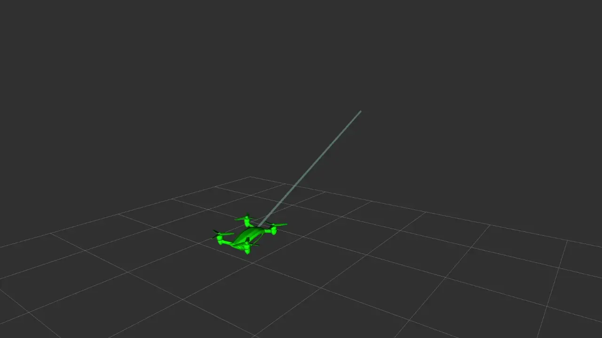
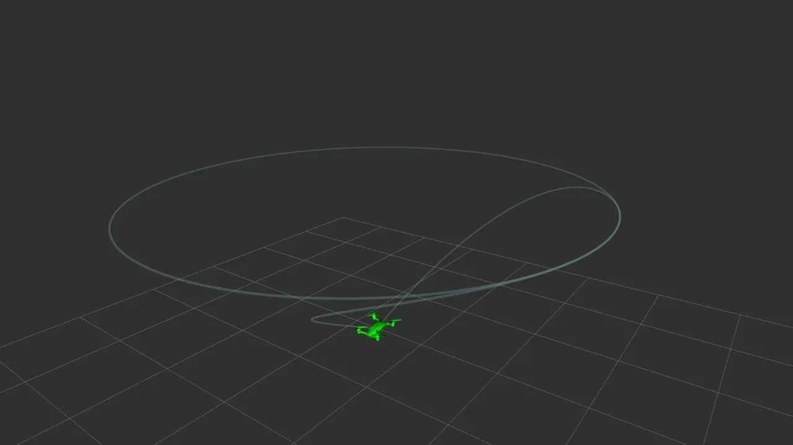
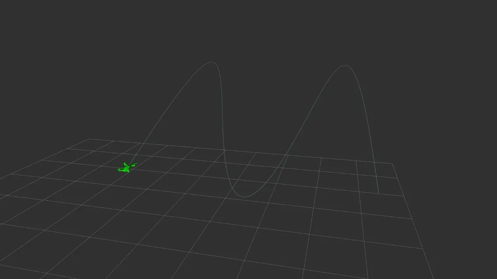

$$
\alpha = \Omega
$$

# Documentation

* 0: smooth back and forth

	This is a composite trajectory made using minsnap polynomials

  * [cvs](https://github.com/poine/quad4d_rebooted/blob/main/outputs/000_back_and_forth.csv)

  
  

  

* 1: circle with intro

  A circle at constant speed. The intro and outro are made using minsnap polynomials.
  
  * [cvs](https://github.com/poine/quad4d_rebooted/blob/main/outputs/001_circle_with_intro_slow.csv)
  
  
  

  

* 3: sphere

 Analytical trajectory, rotating circle

  

* 4: spatialy indexed circle

  Stop-stop trajectory on a geometric circle. Dynamic is minsnap

  

* 5: spatialy indexed slalon

  Stop-stop slalon trajectory. Geometry is described using splines interpolating waypoints, dynamic using minsnap.

  
  
  
<!-- ffmpeg -i /home/poine/2025-10-14\ 00-06-47.mkv -loop 0 /tmp/foo.webp -->
