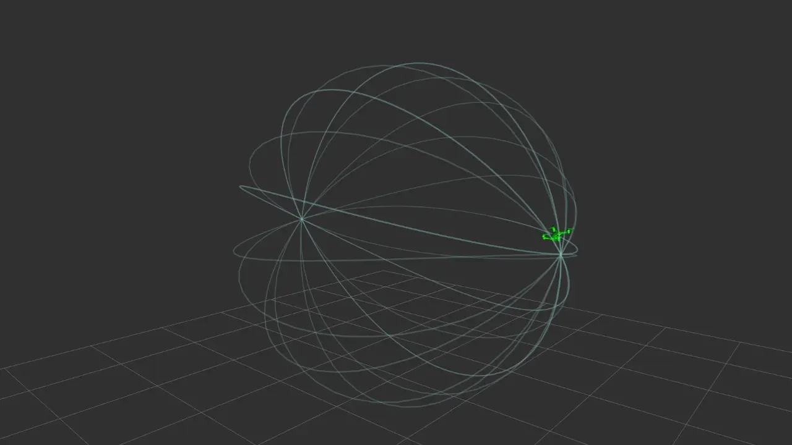
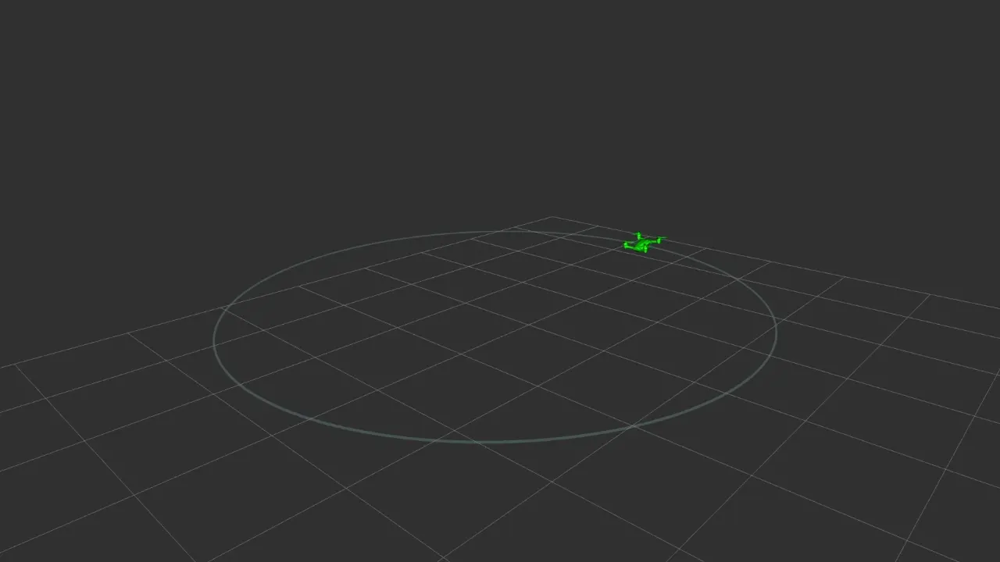

$$
\alpha = \Omega
$$

# Documentation

[trajectoires](trajectories)

### 0: Smooth back and forth

This is a composite trajectory made using minsnap polynomials

  
Details

  
  <a href="https://github.com/poine/quad4d_rebooted/blob/main/outputs/000_back_and_forth.csv">csv</a>

  
  
  

 

### 1: Circle with intro

A circle at constant speed. The intro and outro are made using minsnap polynomials.
  

  
Details

* [csv](https://github.com/poine/quad4d_rebooted/blob/main/outputs/001_circle_with_intro_slow.csv)
  
  
  

 

### 3: Sphere

Analytical trajectory, rotating circle

  
Details

  
  

 

### 4: Spatialy indexed circle

Stop-stop trajectory on a geometric circle. Dynamic is minsnap polynomials

  

  
Details

  
  

 
  

### 5: Spatialy indexed slalon

Stop-stop slalon trajectory. Geometry is described using splines interpolating waypoints, dynamic using minsnap polynomials.

  
Details

  
  
  

 
  
  
### 6: Multivehicle?
  
  
<!-- ffmpeg -i /home/poine/2025-10-14\ 00-06-47.mkv -loop 0 /tmp/foo.webp -->
