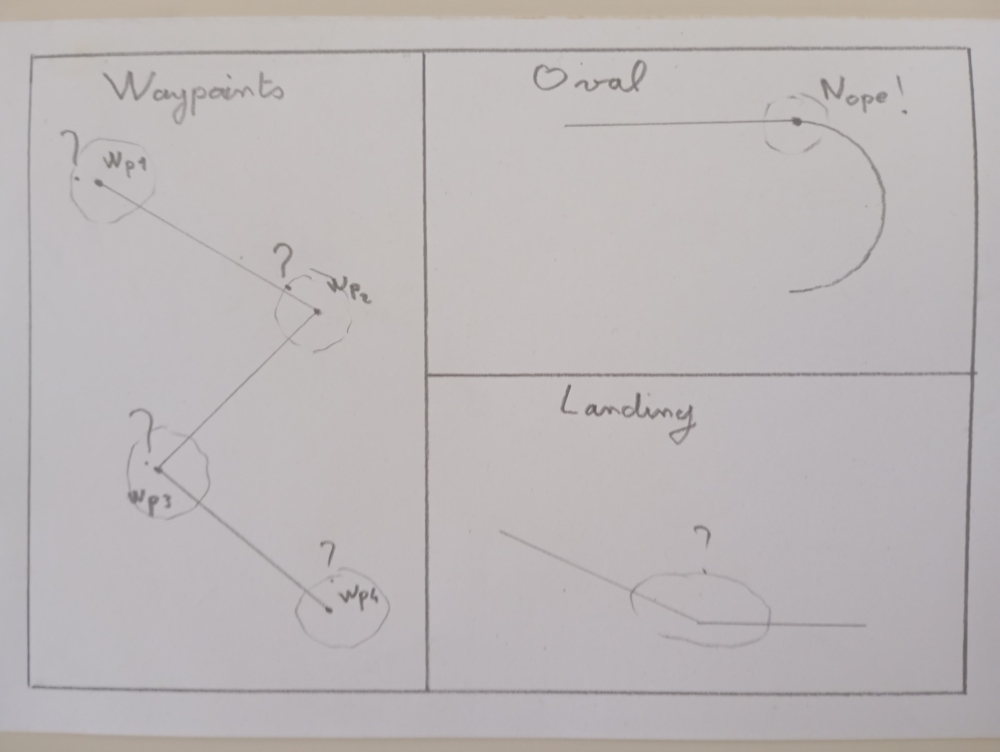

[top](/pres)
[next](/pres/02_platitude)

# Trajectories (control objectives)

## 3D (ill defined)

<figure>
    
    <figcaption>Fig1. - Platitude.</figcaption>
</figure>

  * When?
  * How fast?
  * Bank limits?
  * Actuators saturations?

## 3D+t
  * $$Y(t) = cos(t)$$ (circle or something else ... or $$Y=\Sigma^\infty a_k cos(kt)$$)
  * $$Y(t) = a_0 + a_1 t + a_2 t^2 +...$$ (polynomials)
  * piecewise
$$
Y(t) = \left\{\begin{array}{lr}
        Y_1(t), & \text{for } t_0\leq t\leq t_1\\
        Y_2(t), & \text{for } t_1\leq t \leq t_2\\
        Y_3(t), & \text{for }  t_2\leq t \leq t_3\\
		...
        \end{array}\right\}
$$ ( splines, etc...)
  * Derivatives
  $$ \begin{pmatrix}Y^{(0)} \\ Y^{(1)} \\ ...  \end{pmatrix}$$

  * Accurate (usable) but hard to define 

[top](/pres)
[next](/pres/02_platitude)
