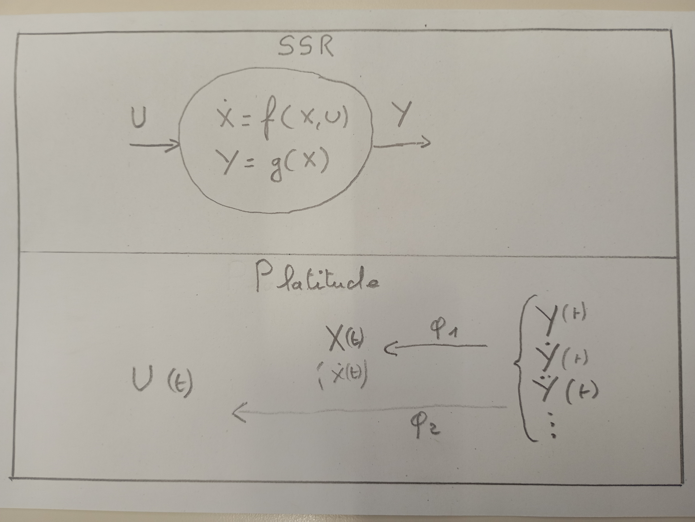
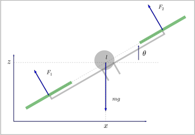

[top](../pres)
[next](03_indexation_spatiale)

### 1: Définition

* Intuition: un avion ou un quad s'incline pour tourner (si et seulement si)

<figure>
    
    <figcaption>Fig1. - Platitude.</figcaption>
</figure>

* Utilisation:
  * Etat (state feedback, $$\Phi_1$$)
  * Commande en boucle ouverte (feedforward, $$\Phi_2$$)
  * Faisabilité de la trajectoire (saturations $$\Phi_1$$ et $$\Phi_2$$)
   
### 2: Exemple

<figure>
    
    <figcaption>Fig1. - PVTOL schematics.</figcaption>
</figure>

#### Dynamique

$$
X= \begin{pmatrix}x&z&\theta&\dot{x}&\dot{z}&\dot{\theta}\end{pmatrix}^T \qquad
U = \begin{pmatrix}f_1 & f_2 \end{pmatrix}^T \qquad
Y = \begin{pmatrix}x & z \end{pmatrix}^T
$$

$$
\dot{X} = \begin{pmatrix}
  \dot{x} \\
  \dot{z} \\
  \dot{\theta} \\
  -\frac{1}{m}  \sin{\theta} \left( f_1+f_2 \right) \\
  -g + \frac{1}{m}  \cos{\theta} \left( f_1+f_2 \right)\\
  \frac{l}{J} \left( -f_1+f_2 \right)
\end{pmatrix}
$$

#### Platitude

$$
\theta = -\arctan(\frac{\ddot{x}}{\ddot{z}+g})
$$

$$
\dot{\theta} = -\frac{\left(\ddt{z}{2}+g\right)\ddt{x}{3} - \ddt{x}{2}\ddt{z}{3}}
{\left(\ddt{z}{2}+g\right)^2 + \left(\ddt{x}{2}\right)^2}
$$

$$
u_t = \sqrt{\left(\ddt{x}{2}\right)^2 + \left(\ddt{z}{2}+g\right)^2}
$$

$$
  u_d =
  \frac{\left[\ddt{x}{4}(\ddt{z}{2}+g)-\ddt{z}{4}\ddt{x}{2}\right]
    \left[(\ddt{z}{2}+g)^2 + (\ddt{x}{2})^2\right] -
    \left[2(\ddt{z}{2}+g)\ddt{z}{3} + 2\ddt{x}{2}\ddt{x}{3}\right]
    \left[\ddt{x}{3}(\ddt{z}{2}+g) - \ddt{z}{3}\ddt{x}{2}\right]}
  {\left(\left(\ddt{z}{2}+g\right)^2 + \left(\ddt{x}{2}\right)^2\right)^2}
$$

(show smooth back and forth)

[top](../pres)
[next](03_indexation_spatiale)
