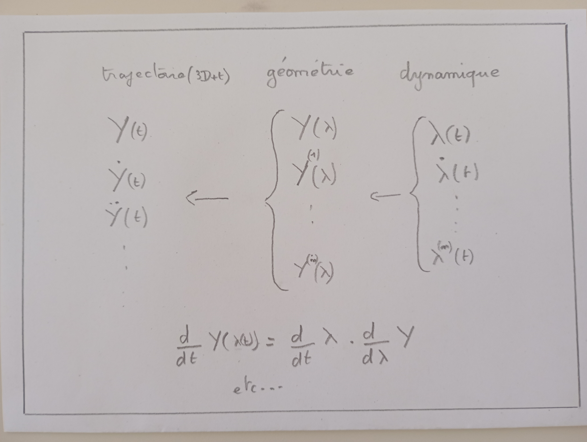

<script src="https://cdn.mathjax.org/mathjax/latest/MathJax.js?config=TeX-AMS-MML_HTMLorMML" type="text/javascript">
</script>

[prev](02_platitude)
[top](../pres)
[next](04_optimization)

### 1: Définition
Il s'agit ici de découpler la géometrie et la dynamique d'une trajectoire.


<figure>
    
    <figcaption>Fig1. - Indexation spatiale.</figcaption>
</figure>

Obtention des dérivées temporelle par dérivation successives de composées.

$$
Y(t) = G(\lambda(t)) \quad t \in [t_0; t_1[ -> \lambda(t) \in [0; 1[
$$

$$
\dot{Y}(t) = \dot{\lambda} \pd{G}{\lambda}
$$

$$
\ddot{Y}(t) = \ddot{\lambda} \pd{G}{\lambda} + \dot{\lambda}^2 \pd{^2G}{^2\lambda}
$$

```
_lambda = _dyn.get(t)
_g = _geom.get(_lambda[0])
Yt[:,0] = _g[:,0]
Yt[:,1] = _lambda[1]*_g[:,1]
Yt[:,2] = _lambda[2]*_g[:,1] + _lambda[1]**2*_g[:,2]
Yt[:,3] = _lambda[3]*_g[:,1] + 3*_lambda[1]*_lambda[2]*_g[:,2] + _lambda[1]**3*_g[:,3]
Yt[:,4] = _lambda[4]*_g[:,1] + (3*_lambda[2]**2+4*_lambda[1]*_lambda[3])*_g[:,2] + 6*_lambda[1]**2*_lambda[2]*_g[:,3] + _lambda[1]**4*_g[:,4]
```


(show space indexed racetrack)

[prev](02_platitude)
[top](../pres)
[next](04_optimization)
