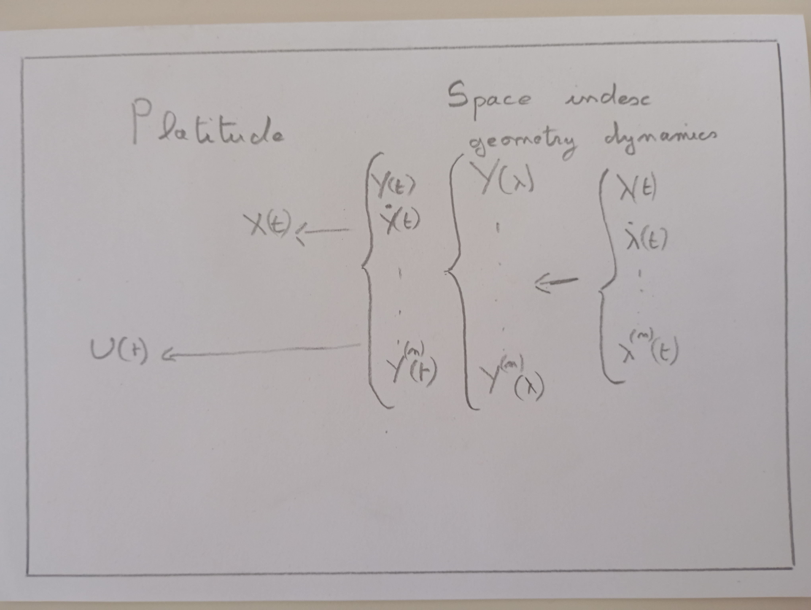

[prev](/pres/03_indexation_spatiale)
[top](/pres)
[next](/pres/05_conclusion)

# Optimization

 * optimize velocity on fixed geometry (1D vs 3D)
   * eg cost: time  contraints: velocity, bank angle, actuators
   
 * optimize geometry, deal with dymanic later (air corridors)  

<figure>
    
    <figcaption>Fig1. - Whatever.</figcaption>
</figure>

     ** result = minimize(cost, x0, constraints=constraints, bounds=bounds)

(show dual space indexed racetrack)

[prev](/pres/03_indexation_spatiale)
[top](/pres)
[next](/pres/05_conclusion)
